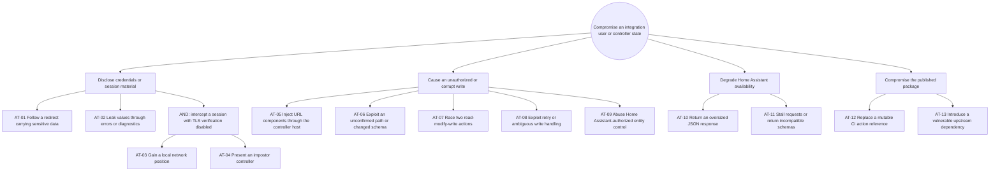

# Security review and threat model

Reviewed: 2026-08-16
Scope: Home Assistant custom integration, local UniFi OS transport, controller
response parsing, verified writes, diagnostics and GitHub release automation.

This review treats controller responses, user-entered connection fields and
repository dependencies as untrusted. Home Assistant authentication,
authorization and config-entry storage are platform trust boundaries. The
integration does not expose a public HTTP endpoint and has no runtime package
dependencies of its own.

## Assets and trust boundaries

- UniFi credentials, session cookie and CSRF value.
- Controller configuration changed by Etherlighting writes.
- Home Assistant availability and diagnostic confidentiality.
- Source and release integrity for HACS users.
- Boundary A: Home Assistant administrator to config flow.
- Boundary B: integration HTTP session to the configured local controller.
- Boundary C: controller JSON to schema and compatibility validation.
- Boundary D: GitHub source and CI to the HACS release consumed by users.

## Attack tree

The root and intermediate nodes are OR nodes unless marked AND. Leaf IDs map to
the requirement and mitigation tables below.

| Leaf | Cost | Skill | Detection | Current treatment |
|---|---|---|---|---|
| AT-01 | Low | Low | Low | Blocked: redirects disabled on every request |
| AT-02 | Low | Low | Medium | Blocked: allowlisted diagnostics and safe errors |
| AT-03 + AT-04 | Medium | Medium | Low | Reduced: TLS verification defaults on; disabling it is an explicit residual risk |
| AT-05 | Low | Low | Medium | Blocked: origin built from a hostname/IP, port and scheme only |
| AT-06 | Low | Medium | High | Blocked: capture-confirmed paths and fail-closed schemas |
| AT-07 | Low | Low | Low | Blocked: one write lock per config entry |
| AT-08 | Low | Medium | High | Blocked: no write retry, independent read-back and Repair on ambiguity |
| AT-09 | Low | Low | High | Delegated to Home Assistant authorization |
| AT-10 | Low | Low | Low | Blocked: streamed JSON has a fixed maximum size |
| AT-11 | Low | Low | High | Reduced: request timeout and fail-closed compatibility checks |
| AT-12 | Low | Medium | Low | Blocked: immutable action commits and Dependabot updates |
| AT-13 | Medium | Medium | Medium | Reduced: no integration runtime dependencies; upstream platform updates remain required |

## Security requirements

| ID | Priority | Testable requirement | Acceptance evidence | Threats |
|---|---|---|---|---|
| SR-001 | Critical | Credentials, cookies, tokens, CSRF values and controller-derived values must never enter logs or diagnostics. Sensitive requests must not follow redirects. | Secret scan; log-redaction tests; redirect assertions | AT-01, AT-02 |
| SR-002 | High | A controller origin must contain only an HTTP(S) scheme, validated hostname/IP and configured port. API paths must remain relative and identifiers URL-encoded. | Host-injection and path-quoting tests | AT-05 |
| SR-003 | Critical | Authentication state must remain in the dedicated in-memory session; writes require the observed CSRF header and must never be retried automatically. | Authentication and adapter tests | AT-01, AT-08 |
| SR-004 | Critical | Unknown Network generations, missing fields and changed response schemas must fail closed before a write. | Compatibility, schema and update-capture validators | AT-06, AT-11 |
| SR-005 | Critical | A write must change one allowlisted semantic value, serialize with other writes, preserve required fields and receive an independent read-after-write result. | Payload-diff, concurrency and verification tests | AT-07, AT-08 |
| SR-006 | High | Controller requests must have a total timeout and JSON responses must be decoded incrementally under a fixed size limit. | Transport and response-limit tests | AT-10, AT-11 |
| SR-007 | High | CI dependencies must be immutable, automatically reviewed for updates and every change must run blocking SAST. | SHA-pin check, Dependabot, Semgrep rule tests and CodeQL workflow | AT-12, AT-13 |
| SR-008 | High | Public issue intake and diagnostics must instruct users not to submit secrets or raw captures. | Issue template and diagnostics allowlist tests | AT-02 |

## Threat-to-control mapping

| Control | Type / layer | Threats | Verification |
|---|---|---|---|
| C-01 Strict controller-origin and relative-path construction | Preventive / application | AT-05 | Unit tests |
| C-02 Redirect suppression and TLS enabled by default | Preventive / network | AT-01, AT-03, AT-04 | Unit tests and config schema |
| C-03 In-memory session state, allowlisted diagnostics and safe exceptions | Preventive / data | AT-01, AT-02 | Unit tests and secret scan |
| C-04 Capture-confirmed endpoints, version gate and defensive schemas | Preventive / application | AT-06, AT-11 | Unit tests and offline validators |
| C-05 Serialized, projected read-modify-write with independent read-back | Preventive / application | AT-07, AT-08 | Concurrency and write tests |
| C-06 Write block plus Home Assistant Repair after ambiguity | Corrective / application | AT-08 | Error-path tests |
| C-07 Timeout and bounded streamed JSON decoder | Preventive / application | AT-10, AT-11 | Boundary tests |
| C-08 Pinned CI actions, Dependabot, Semgrep and CodeQL | Preventive + detective / process | AT-12, AT-13 | Workflow and rule validation |
| C-09 Private security-advisory link and sanitized bug template | Detective / process | AT-02, AT-13 | Repository review |

Every identified leaf has at least one control. Critical write-integrity paths
have preventive validation plus corrective blocking. Supply-chain detection is
completed by CodeQL and the repository-specific Semgrep rules.

## Residual risks and release decision

- Disabling TLS certificate verification permits a local network attacker to
  impersonate the controller. The option remains necessary for self-signed
  local controllers, defaults to enabled verification and must be documented
  as an explicit user choice.
- Home Assistant controls access to config-entry secrets and entity actions.
  The integration must not implement a second authorization system.
- Future UniFi schema changes can disable control availability. They must fail
  closed until a sanitized live capture confirms the new contract.
- Home Assistant owns its pinned transitive dependencies. This integration must
  not override platform packages; users should install Home Assistant security
  updates promptly.

Decision: the reviewed local patch has no open blocking integration-owned
security gap. GitHub CodeQL execution and the normal release checks are still
required after the patch is pushed.
